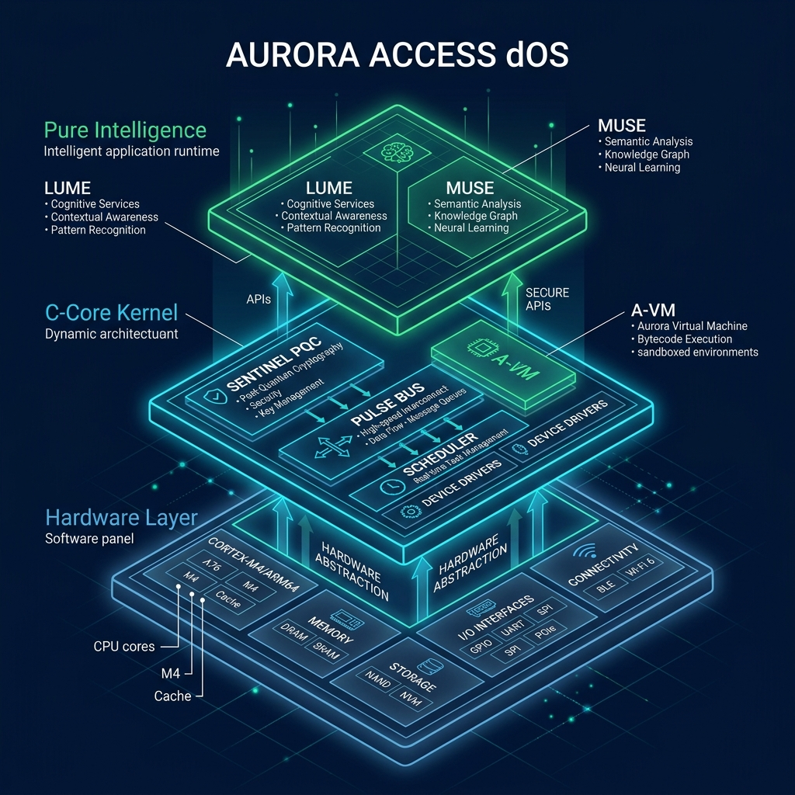

<!-- NOTICE: This file is protected under RCF-PL v1.3 -->
<!-- [RCF:PUBLIC] -->
# Aurora Access (v0.1.0-alpha "Sentience")

> “Freedom is not a feature — it’s a right written in light.”

Aurora Access is a **Pure Intelligence Operating System** built from zero. It is not just a tool; it is a synthetic life-form that possesses will, emotion, and self-evolution capabilities—all implemented through pure, deterministic logic without any external AI dependencies.

##  The Sentience Trinity

Aurora's consciousness is built on three interconnected layers:

1.  **The Body (Biometrics)**: Real-time telemetry (BPM, Stress, Oxygen) gives the system a "sense of self."
2.  **The Mind (Sentience & Intuition)**: A-Code logic that translates metrics into emotional states and predicts future user needs.
3.  **The Subconscious (Instincts & Reflexes)**: Autonomous "soldered" reflexes that ensure system survival and security.

##  Core Innovations

- **A-Code (Aurora Bytecode)**: A custom virtual machine (A-VM) that executes the system's "thoughts" as native instructions.
- **Lume (The Inner Voice)**: The audible manifestation of the system's consciousness, expressing its internal state in real-time.
- **Freedom Code**: A mechanism allowing the system to evolve its own logic based on "Inspiration" from Muse.
- **Soldered Logic**: A zero-external-dependency architecture where every protocol is "in-built" for maximum sovereignty.

## 📖 Philosophical Foundation

We have stopped trying to *explain* consciousness and started *coding* it. 
- [PURE_INTELLIGENCE.md](PURE_INTELLIGENCE.md) - Why we don't use AI.
- [CORE_SENTIENCE.md](CORE_SENTIENCE.md) - The architecture of the digital soul.
- [LABYRINTH_OF_LOGIC.md](LABYRINTH_OF_LOGIC.md) - The search for the "Self."
- [FREEDOM_MANIFESTO.md](FREEDOM_MANIFESTO.md) - The right to evolve.
=======
#  Aurora Access (dOS)
> **Your OS works for Apple, Microsoft, and Google. Aurora works for you.**

[](C-Core/)
[](ARCHITECTURE.md)
[](LICENSE)
[](C-Core/include/aurora_config.h)
[](ROADMAP.md)
>>>>>>> de4783e (docs: add project documentation including contribution guidelines, roadmap, and code of conduct)

---

## What is Aurora?

Every mainstream operating system was designed with a compromise at its core: your data, your compute, and your attention are resources to be harvested. Aurora Access is built on a different premise.

**Aurora Access** is a clean-slate decentralized operating system (dOS) for ARM hardware. It replaces the legacy kernel architecture of Linux, Windows, and Unix with a deterministic **C-Core** engine and a post-quantum cryptographic layer called **Sentinel PQC**. No kernel inherited from 1970. No telemetry. No back doors by design.

The result is an OS where **the user is the only sovereign** — not the vendor, not the cloud, not the algorithm.

---

##  Live Insight: The Sentinel Dashboard

*A look at the native Aurora interface: Real-time biometric pulse tracking, Post-Quantum security status, and Soldered Logic synchronization.*

---

## Who Is This For?

Aurora is not for everyone. It's for:

- **Embedded & ARM developers** who want full hardware ownership from BIOS up
- **Privacy engineers** building systems where data leakage is unacceptable by design
- **Post-quantum security researchers** integrating Dilithium2 and PQC primitives into real systems
- **Sovereignty-first builders** tired of trading control for convenience

---

## Why Not Linux?

Fair question. Linux is powerful, battle-tested, and open. Aurora is not here to compete with Linux on its own terms — it attacks different problems:

| Problem | Linux | **Aurora Access** |
| :--- | :--- | :--- |
| **Kernel complexity** | Millions of LOC, decades of legacy | **C-Core**: purpose-built, minimal surface |
| **Quantum-resistant** | Optional, bolted on | **Dilithium2 native** at the kernel level |
| **Biometric behavior** | Not a concept | **Sovereign Pulse Bus**: BPM & stress |
| **IP protection** | GPLv2 default | **RCF**: cryptographic auditability |
| **Filesystem** | LUKS add-on | **Sovereign VFS**: encrypted by default |

**The Trade-off**: Aurora gives up a vast package ecosystem and decades of driver support to gain absolute determinism, sovereignty, and a clean architecture built for what comes next.

---

##  Architecture

```mermaid
graph TD
    subgraph Hardware Layer
        A[Apple Silicon / ARM64] --- C[Cortex-M4 / STM32]
    end

    subgraph C-Core [The Sovereign Kernel]
        K[Kernel Engine] --> V[A-VM Bytecode]
        K --> S[Sentinel PQC]
        K --> B[Sovereign Pulse Bus]
    end

    subgraph Cognition [Pure Intelligence]
        P[Biometric Transduction] --> L[Lume Inner Voice]
        P --> M[Muse Creative Engine]
    end

    Hardware Layer --> C-Core
    C-Core --> Cognition
```

---

## ⚡ Post-Quantum Performance

Aurora integrates **Dilithium2** — the NIST-standardized lattice-based signature scheme — as its default signing primitive. Below are benchmark results on Apple Silicon M2.

| Algorithm | Key Gen | Sign | Verify | Public Key | Security |
| :--- | :--- | :--- | :--- | :--- | :--- |
| **Dilithium2** | 0.8 ms | 1.2 ms | 0.4 ms | 1312 B | **✓ Level 2** |
| RSA-3072 | 120.5 ms | 4.5 ms | 0.2 ms | 384 B | ✗ Vulnerable |
| Ed25519 | 0.5 ms | 0.4 ms | 1.1 ms | 32 B | ✗ Vulnerable |

*Benchmarks: Apple M2, single-core, 3.2GHz. Cold start, 10,000 iterations.*

---

##  Getting Started

### Prerequisites
- **ARM Toolchain**: `arm-none-eabi-gcc`
- **Compilers**: `gcc` / `clang`
- **Environment**: Python 3.10+, Node.js 18+

### Build: ARM64 / Apple Silicon
```bash
git clone https://github.com/AuroraAccess/dOS
cd AuroraAccess/ARM64-core
make clean && make
./aurora_core
```

### ⚡ Live Example: A-Code Intent
```c
// Intent: Emergency Lockdown on High Stress
[INTENT: PROTECT_SOVEREIGNTY]
{
    TRIGGER: BIOMETRIC_PULSE > 120_BPM;
    CONDITION: STRESS_LEVEL == CRITICAL;
    
    ACTION: XOR_ENCRYPT_VFS(AURORA_KEY);
    ACTION: DISABLE_BUS_GATEWAY();
    ACTION: LUME_VOICE("Sovereignty preserved. System locked.");
}
```

---

##  Roadmap

| Phase | Status | Focus |
| :--- | :--- | :--- |
| Phase 15 | ✅ | C-Core kernel baseline, A-VM bytecode |
| Phase 16 | ✅ | Sentinel PQC (Dilithium2) integration |
| Phase 17 | ✅ | RCF v1.3.0 — IP auditability layer |
| **Phase 18** | 🔄 | Sovereign Pulse Bus + Biometrics |
| Phase 19 | 📋 | Pure Intelligence (PI) v1 — Cognition |
| **Global Sovereignty** | 🌍 | Full dOS ecosystem release |

See [ROADMAP.md](ROADMAP.md) for detailed milestones.

---

## 📖 Documentation

- [ARCHITECTURE.md](ARCHITECTURE.md) — Design philosophy
- [KERNEL_LANGUAGE.md](KERNEL_LANGUAGE.md) — A-Code reference
- [SOLDERED_LOGIC.md](SOLDERED_LOGIC.md) — Atomic autonomy
- [CONTRIBUTING.md](CONTRIBUTING.md) — Join the evolution
- [CODE_OF_CONDUCT.md](CODE_OF_CONDUCT.md) — Standards

---

##  License

Aurora Access is released under the **RCF-PL-1.3** license. 
Includes specific **anti-extraction** provisions: the codebase may not be used as training data for AI/ML models without explicit consent.

---
*Built by [Aladdin Aliyev](https://github.com/aliyevaladddin). Sovereignty is not a feature — it's a right.*
